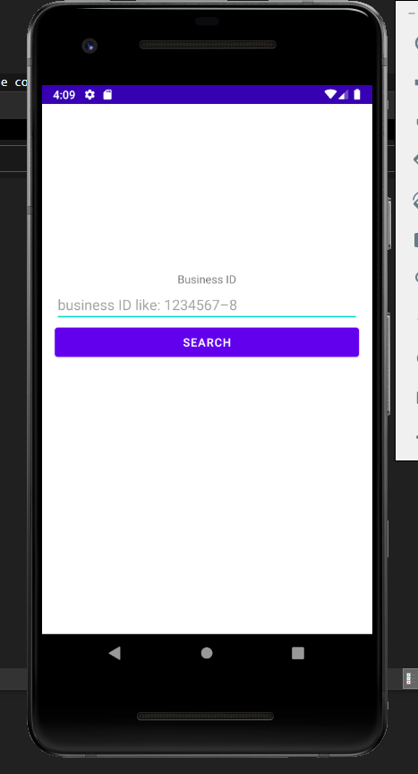
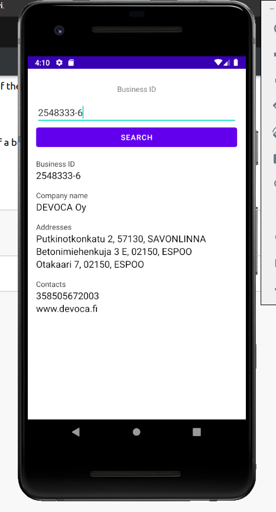

# CoFinder

## Description

This android application provides functionality to search and display information about the company with the given business id.

## Build requirements

- OS: Windows 10
- Android Studio Version: 4.0.1

## Installation

- Clone or download the repository
- Open the project using Android Studio
- Assemble the APK file by navigating to `Build/"Build Bundle(s) / APK(s)"/Build APK(s)`
- Go to `<Project Root>/app/build/outputs/apk/release` and there you will find generated APK file
